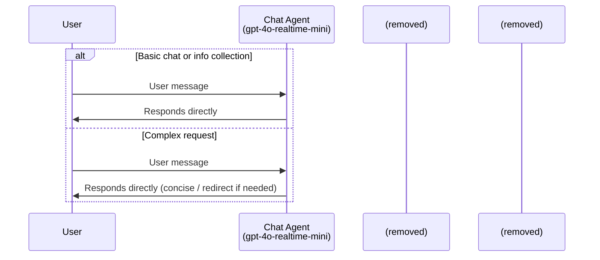
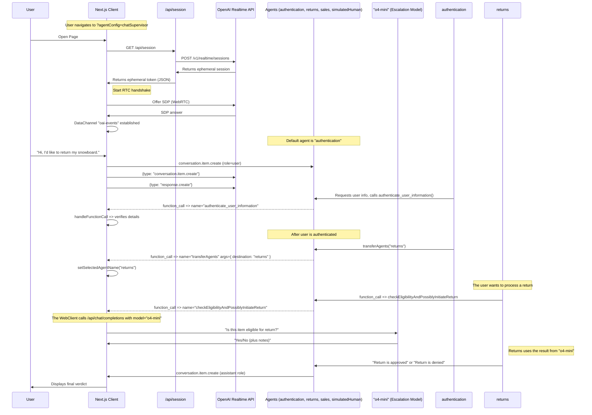

# Englify Realtime English Tutor

This project implements an English-teaching voice agent using the OpenAI Realtime API and the OpenAI Agents SDK.

## About the OpenAI Agents SDK

This project uses the [OpenAI Agents SDK](https://github.com/openai/openai-agents-js), a toolkit for building, managing, and deploying advanced AI agents. The SDK provides:

- A unified interface for defining agent behaviors and tool integrations.
- Built-in support for agent orchestration, state management, and event handling.
- Easy integration with the OpenAI Realtime API for low-latency, streaming interactions.
- Extensible patterns for multi-agent collaboration, handoffs, tool use, and guardrails.

For full documentation, guides, and API references, see the official [OpenAI Agents SDK Documentation](https://github.com/openai/openai-agents-js#readme).

**NOTE:** For a version that does not use the OpenAI Agents SDK, see the [branch without-agents-sdk](https://github.com/openai/openai-realtime-agents/tree/without-agents-sdk).

Primary pattern used:
1. **Personalized Chat Agent:** A realtime chat agent with integrated Englify backend API access for personalized learning experiences.

## Setup

- This is a Next.js typescript app. Install dependencies with `npm i`.
- Copy `env.example` to `.env` and configure your environment variables:
  ```bash
  cp env.example .env
  ```
- Add your API keys and backend configuration:
  - `OPENAI_API_KEY`: Your OpenAI API key for Realtime API
  - `ENGLIFY_API_URL`: Your Englify backend API base URL
  - `ENGLIFY_API_TOKEN`: API token for backend authentication
  - `ENGLIFY_BEARER_TOKEN`: Bearer token for user-specific requests
- Start the server with `npm run dev`
- Open your browser to [http://localhost:3000](http://localhost:3000). It should default to the `chatSupervisor` Agent Config.
- You can change examples via the "Scenario" dropdown in the top right.

# Chat-Supervisor

This is implemented in the [chatSupervisor](src/app/agentConfigs/chatSupervisor/index.ts) Agent Config. The chat agent integrates with your Englify backend to provide personalized learning experiences.

Video walkthrough: [https://x.com/noahmacca/status/1927014156152058075](https://x.com/noahmacca/status/1927014156152058075)

## Example

*In this exchange, note the immediate response to keep the flow natural and brief.*

## Schematic


## Benefits
- **Simpler onboarding.** If you already have a performant text-based chat agent, you can give that same prompt and set of tools to the supervisor agent, and make some tweaks to the chat agent prompt, you'll have a natural voice agent that will perform on par with your text agent.
- **Simple ramp to a full realtime agent**: Rather than switching your whole agent to the realtime api, you can move one task at a time, taking time to validate and build trust for each before deploying to production.
- **High intelligence**: You benefit from the high intelligence, excellent tool calling and instruction following of models like `gpt-4.1` in your voice agents.
- **Lower cost**: If your chat agent is only being used for basic tasks, you can use the realtime-mini model, which, even when combined with GPT-4.1, should be cheaper than using the full 4o-realtime model.
- **User experience**: It's a more natural conversational experience than using a stitched model architecture, where response latency is often 1.5s or longer after a user has finished speaking. In this architecture, the model responds to the user right away, even if it has to lean on the supervisor agent.
  - However, more assistant responses will start with "Let me think", rather than responding immediately with the full response.

## Modifying for your own agent
1. Update [chatAgent](src/app/agentConfigs/chatSupervisor/index.ts).
  - Customize the chatAgent instructions with your own tone, greeting, etc.
2. To reduce cost, try using `gpt-4o-mini-realtime` for the chatAgent.

# Agentic Pattern 2: Sequential Handoffs

This pattern is inspired by [OpenAI Swarm](https://github.com/openai/swarm) and involves the sequential handoff of a user between specialized agents. Handoffs are decided by the model and coordinated via tool calls, and possible handoffs are defined explicitly in an agent graph. A handoff triggers a session.update event with new instructions and tools. This pattern is effective for handling a variety of user intents with specialist agents, each of which might have long instructions and numerous tools.

Here's a [video walkthrough](https://x.com/OpenAIDevs/status/1880306081517432936) showing how it works. You should be able to use this repo to prototype your own multi-agent realtime voice app in less than 20 minutes!


*In this simple example, the user is transferred from a greeter agent to a haiku agent. See below for the simple, full configuration of this flow.*

Configuration in `src/app/agentConfigs/simpleExample.ts`
```typescript
import { RealtimeAgent } from '@openai/agents/realtime';

// Define agents using the OpenAI Agents SDK
export const haikuWriterAgent = new RealtimeAgent({
  name: 'haikuWriter',
  handoffDescription: 'Agent that writes haikus.', // Context for the agent_transfer tool
  instructions:
    'Ask the user for a topic, then reply with a haiku about that topic.',
  tools: [],
  handoffs: [],
});

export const greeterAgent = new RealtimeAgent({
  name: 'greeter',
  handoffDescription: 'Agent that greets the user.',
  instructions:
    "Please greet the user and ask them if they'd like a haiku. If yes, hand off to the 'haikuWriter' agent.",
  tools: [],
  handoffs: [haikuWriterAgent], // Define which agents this agent can hand off to
});

// An Agent Set is just an array of the agents that participate in the scenario
export default [greeterAgent, haikuWriterAgent];
```
## Teaching Flow & API Integration

The agent now uses API tool-calling to provide personalized learning experiences:

### Available API Tools
- `getUserProfile` - Get user's current level, points, and progress
- `getLeaderboard` - Check user's ranking among peers
- `getPodcasts` - Fetch available podcasts for listening practice
- `getMovies` - Get movies suitable for the user's level
- `getBooks` - Find books for reading practice
- `getRecommendations` - Get personalized content suggestions based on user level
- `getResourceDetails` - Get detailed information about specific content

### Personalization Features
- Knows user's current English level (Starter, Beginner, Elementary, etc.)
- Recommends content matching user's proficiency
- Tracks learning progress and achievements
- Provides level-appropriate corrections and guidance
- Suggests next steps based on user performance

## Schematic

This diagram (from the original demo) illustrated a more advanced interaction flow; the current app focuses on the chatSupervisor tutoring flow.

<details>
<summary><strong>Show CustomerServiceRetail Flow Diagram</strong></summary>



</details>

# Other Info
## Next Steps
- You can copy these templates to make your own multi-agent voice app! Once you make a new agent set config, add it to `src/app/agentConfigs/index.ts` and you should be able to select it in the UI in the "Scenario" dropdown menu.
- Each agentConfig can define instructions, tools, and toolLogic. By default all tool calls simply return `True`, unless you define the toolLogic, which will run your specific tool logic and return an object to the conversation (e.g. for retrieved RAG context).
 - Each agentConfig can define instructions; tool-calling is removed in this branch.
- If you want help shaping your own English tutor prompt, see the metaprompt [here](src/app/agentConfigs/voiceAgentMetaprompt.txt).

## Output Guardrails
Assistant messages are checked for safety and educational relevance. Categories: `INAPPROPRIATE`, `OFF_TOPIC`, `NON_ENGLISH`, `NONE`. See `src/app/agentConfigs/guardrails.ts` and `src/app/types.ts`.

## Navigating the UI
- You can select agent scenarios in the Scenario dropdown, and automatically switch to a specific agent with the Agent dropdown.
- The conversation transcript is on the left, including agent changes. Click to expand non-message elements.
- The event log is on the right, showing both client and server events. Click to see the full payload.
- On the bottom, you can disconnect, toggle between automated voice-activity detection or PTT, turn off audio playback, and toggle logs.

## Pull Requests

Feel free to open an issue or pull request and we'll do our best to review it. The spirit of this repo is to demonstrate the core logic for new agentic flows; PRs that go beyond this core scope will likely not be merged.

# Core Contributors
- Noah MacCallum - [noahmacca](https://x.com/noahmacca)
- Ilan Bigio - [ibigio](https://github.com/ibigio)
- Brian Fioca - [bfioca](https://github.com/bfioca)
